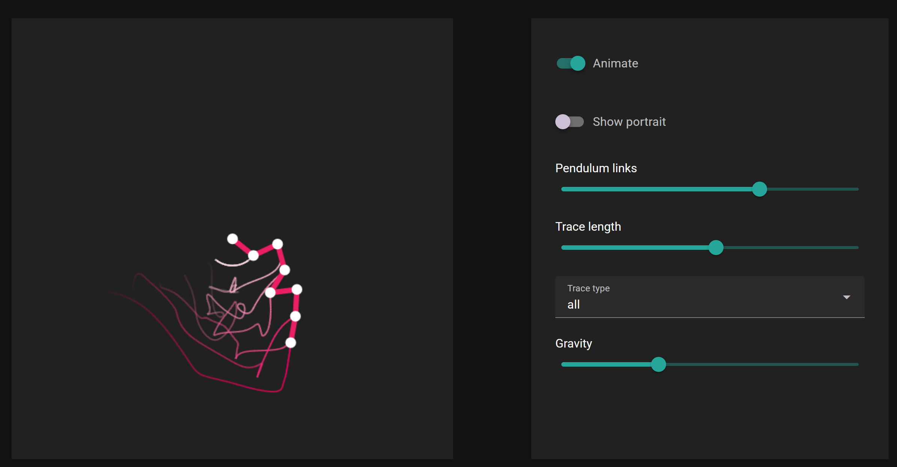

## Autorzy

**Adam Jeliński** - kod odpowiedzialny za UI

**Miłosz Mizak** - matematyka i silnik fizyczny

## Link do wersji online

[https://charodziej.github.io/fo-n-pendulum/](https://charodziej.github.io/fo-n-pendulum/)

## Cel projektu

Celem projektu było zbudowanie symulacji n-stopniowego wahadła, a więc takiego wahadła gdzie użytkownik może dowolnie modyfikować liczbę kulek. Oprócz tego użytkownik ma także możliwość modyfikacji siły grawitacji, co pozwala sprawdzić jak takie wahadło zachowywałoby się np. na Księżycu.

## Strona wizualna



Na powyższym obrazku przedstawiony jest widok użytkownika. Po lewej stronie znajduje się symulacja wahadła z podaną ilością węzłów. Po prawej stronie znajduje się panel sterowania z następującymi opcjami:
- **Animate** - naciśnięcie tego przełącznika rozpoczyna symulację. Dzięki możliwości zatrzymania symulacji użytkownik może wcześniej ustawić wahadło w dogodnej dla siebie pozycji.
- **Show portrait** - ta opcja podmienia widok symulacji na widok portretu fazowego.
- **Pendulum links** - tutaj można ustawić, ile węzłów ma zawierać wahadło.
- **Trace length** - ta opcja zmienia długość śladu pozostawianego przez każdy z węzłów.
- **Trace type** - w aplikacji dostępne są trzy rodzaje śladów - pełny (all), tylko dla ostatniego węzła (tip) lub brak śladu (none).
- **Gravity** - suwak pozwalający na zmianę wartości grawitacji.

## Implementacja

Aplikacja została napisana w całości w języku JavaScript, z użyciem biblioteki Vue. Biblioteka została użyta do stworzenia całego UI aplikacji. Dzięki takiej implementacji aplikacja może działać w przeglądarce, co jest bardzo wygodne, gdyż dzięki temu można uruchomić symulację także na telefonach.

Do zarządzania stanem aplikacji wykorzystana jest biblioteka pinia, a do rysowania użyliśmy biblioteki konva. W celu uproszczenia operacji matematycznych korzystamy z mathjs.

### UI

Kod podzielony jest na 4 segmenty:

- `stores/pendulum.js` - pinia store zajmujący się całym stanem aplikacji, przechowuje aktualne ułożenie wahadła, jego historię oraz zajmuje się aktualizacją tego stanu.
- `components/SimulationRenderer.vue` - wyświetla symulację wahadła
- `components/PortraitRenderer.vue` - wyświetla portret fazowy
- `components/PendulumSimulation.vue` - wyświetla odpowiedni renderer oraz menu do konfiguracji symulacji

Główny stan wahadła dla symulacji jest opisany poprzez kąty i prędkości kątowe. Wartości te są automatycznie konwertowane na pozycje węzłów wahadła w celu uproszczenia wyświetlania (wartość `position`). 

W celu umożliwienia poruszania wahadłem stworzyliśmy prostą implementację algorytmu fabrik (forward and backward inverse kinematics). Dzięki temu można ciągnąć za dowolny element wahadła i pozostałe są automatycznie dostosowane (funkcja `fabrikMove`).

Cała symulacja fizyczna jest wykonywana wewnątrz funkcji `simulationTick`.

W celu optymalizacji procesu wyświetlania wahadła i jego śladu wiele danych jest kopiowane funkcją `toRaw`. To bardzo znacząco przyspieszyło symulację i wyświetlanie.

### Silnik fizyczny

Aplikacja została skonstruowana w taki sposób, że cały silnik fizyki znajduje się w jednym pliku pod nazwą *pendulum.js*. 

Cała symulacja wahadła opiera się na użyciu równania Eulera-Lagrange'a do uzyskania równań ruchu. Aby użyć równania Eulera-Lagrange'a, trzeba zrobić dwie rzeczy.

Po pierwsze, trzeba opisać cały układ używając jakiejś zmiennej i pochodnej po czasie tej zmiennej. W tym przypadku posłużymy się kątem odchylenia danego węzła od pionu. Takie rozwiązanie dobrze generalizuje się dla n węzłów, gdyż możemy wtedy otrzymać położenie każdego węzła za pomocą prostej sumy:

$$
x_i = \sum_{j=1}^i\sin\phi_j
$$
$$
y_i = -\sum_{j=1}^i\cos\phi_j
$$

Po drugie, należy policzyć Lagrangian układu. Wzór na Lagrangian to

$$
L = T - V
$$

gdzie $T$ to energia kinetyczna układu, a $V$ to energia potencjalna. Wzory na te energie prezentują się następująco:

$$
T = \frac{1}{2}\sum_{i=1}^n m_i v_i^2
$$

$$
 V = \sum_{i=1}^nm_igy_i
$$

Po wyliczeniu Lagrangianu możemy podstawić go pod równanie Eulera-Lagrange'a:

$$
\frac{d}{dt}\left(\frac{\partial L}{\partial \dot{\theta}_i}\right) - \frac{\partial L}{\partial \theta_i} = 0
$$

Po wielu przekształceniach dostajemy następujące równanie:

$$
\sum_{j=1}^{n}c(i,j)\ddot{\phi_j}\cos(\phi_{i} - \phi_j) = -\sum_{j=1}^{n}\left[c(i,j)\dot{\phi}_j^2\sin(\phi_i - \phi_j)\right] - g(n - i + 1)\sin\phi_i
$$

Jako że stan naszego układu jest opisywany przez kąty odchylenia węzłów od pionu oraz prędkości kątowe węzłów, to możemy dzięki temu równaniu wyliczyć przyspieszenia kątowe. To z kolei pozwala nam wyliczyć nowe prędkości kątowe i nowe kąty odchylenia, co daje nam nowy stan układu. Powyższe równanie można potraktować jak równanie macierzowe, gdzie lewa strona to macierz $A$, wektor przyspieszeń kątowych to $x$, a prawa strona to wektor wynikowy - $b$.

Koniecznym jest zastosowanie tutaj metod numerycznych. Niestety zwykła metoda Eulera jest tutaj niewystarczająca. Zamiast niej posłużyliśmy się metodą Runge-Kutta (RK4). 

### Instrukcja instalacji projektu

1. Instalujemy Node.js używając **nvm** oraz **pnpm**, korzystając z tej strony: [https://nodejs.org/en/download/package-manager](https://nodejs.org/en/download/package-manager "https://nodejs.org/en/download/package-manager")
2. Pobieramy kod i wchodzimy do głównego katalogu
3. Wykonujemy dwie komendy:

```
$ pnpm install
$ pnpm run dev
```

Po wykonaniu tych czynności projekt powinien załadować się lokalnie pod adresem `localhost:3000`.
